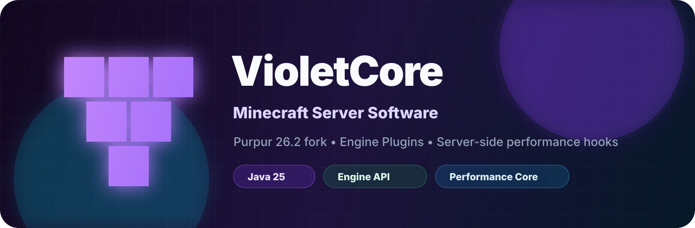

<p align="center">
  
</p>

<p align="center">
  <a href="https://github.com/tkjij77-ctrl/VioletCore/actions/workflows/ci.yml"></a>
  <a href="https://github.com/tkjij77-ctrl/VioletCore/releases/tag/v0.9.0"></a>
  
  
</p>

# VioletCore

**VioletCore** is a Purpur 26.2 based Minecraft server software prototype focused on a new server-side extension layer called **Engine Plugins**.

Engine Plugins are not normal Bukkit plugins. They are version-locked, restart-only modules that can use controlled internal hooks exposed by VioletCore.

> This repository is for the **server software core only**.

---

## Download

> **Note:** the `v0.9.0` release is incomplete — the server jar failed to upload and its
> download link returns 404. Use the [latest release page](https://github.com/tkjij77-ctrl/VioletCore/releases/latest)
> and confirm `VioletCore-26.2-<version>.jar` is listed before downloading, or
> [build from source](#build-from-patches). The release workflow now fails instead of
> publishing a partial release.

### All releases

[VioletCore releases](https://github.com/tkjij77-ctrl/VioletCore/releases/latest)

Each complete release contains:

```text
VioletCore-26.2-<version>.jar          # server jar
VioletCore-API-26.2-<version>.jar      # API jar for Engine Plugin developers
SmartEntityTick-<version>.jar          # optional official Engine Plugin
SHA256SUMS.txt                         # checksums for all of the above
```

Verify what you downloaded:

```bash
sha256sum -c SHA256SUMS.txt
```

---

## Run

Requires **Java 25**.

```bash
java -Xmx4G -jar VioletCore-26.2-v0.9.0.jar --nogui --engine-plugins-dir engine-plugins
```

Accept the Minecraft EULA before running a live server:

```text
eula=true
```

---

## Repository layout

```text
.
├── README.md
├── LICENSE
├── NOTICE.md
├── SECURITY.md
├── CHANGELOG.md
├── assets/
│   └── banner.svg
├── docs/
│   ├── DEVELOPMENT.md
│   ├── ENGINE_PLUGINS.md
│   ├── SMART_ENTITY_TICK.md
│   ├── TROUBLESHOOTING.md
│   ├── V0.4_PLAN.md
│   └── V0.5_PLAN.md
├── examples/
│   ├── engine-plugin/
│   └── smart-entity-tick/
├── templates/
│   └── engine-plugin-template/
├── patches/
│   ├── purpur-api/
│   └── purpur-server/
└── engine-plugins/
    └── .gitkeep
```

---

## Engine Plugins

Default directory:

```text
engine-plugins/
```

Metadata file inside every Engine Plugin jar:

```yaml
name: ExampleEnginePlugin
version: 1.0.0
main: dev.example.ExampleEnginePlugin
type: engine-plugin
target-server: VioletCore
target-version: 26.2
load-phase: pre-minecraft
reloadable: false
modifies:
  - entity-ticking
conflicts: []
mixin-configs: []
```

Current stable hooks and interfaces:

- `TickObserver`
- `EntityTickController`
- `EngineStatsProvider`
- `onLoad`
- `onServerStarted`
- `onServerStopping`
- `onUnload`

Read more: [`docs/ENGINE_PLUGINS.md`](docs/ENGINE_PLUGINS.md)

Create your first Engine Plugin: [`docs/ENGINE_PLUGIN_FROM_SCRATCH.md`](docs/ENGINE_PLUGIN_FROM_SCRATCH.md)

API artifacts: [`docs/API_ARTIFACTS.md`](docs/API_ARTIFACTS.md)

---

## Engine plugin config

VioletCore creates this file on first boot:

```text
engine-plugins.yml
```

Default:

```yaml
engine-enabled: true
strict-version-check: true
warn-undeclared-entity-controller: true
fail-fast-on-plugin-error: false
debug-logging: false
disabled-plugins: []
```

Commands:

```text
/violetcore status
/violetcore engineplugins
/violetcore hooks
/violetcore config
/violetcore reloadconfig
/violetcore stats
/violetcore resetstats
/violetcore version
```

---

## SmartEntityTick

`SmartEntityTick` is the first official optional performance Engine Plugin.

Default behavior throttles only safer far-away entity categories:

```text
ITEM
EXPERIENCE_ORB
ARMOR_STAND
```

It does not affect players, animals, or monsters by default.

Read more: [`docs/SMART_ENTITY_TICK.md`](docs/SMART_ENTITY_TICK.md)

Engine skip counters can be inspected with:

```text
/violetcore stats
/violetcore resetstats
```

---

## Build from patches

See [`docs/DEVELOPMENT.md`](docs/DEVELOPMENT.md).

Short version:

```bash
git clone --branch ver/26.2 --single-branch https://github.com/PurpurMC/Purpur.git VioletCore
cd VioletCore
# copy this repository's patches/ into the same relative locations
./gradlew applyAllPatches
./gradlew :purpur-server:createBundlerJar -x test
```

---

## Status

VioletCore is currently **pre-beta**.

Recommended stage:

```text
v0.4.x = performance core prototype
v0.5.x = stability beta preparation
v1.0.0 = stable launch target
```

---

## Credits

VioletCore is built on top of:

- [PurpurMC/Purpur](https://github.com/PurpurMC/Purpur)
- [PaperMC/Paper](https://github.com/PaperMC/Paper)
- [Paperweight](https://github.com/PaperMC/paperweight)

Minecraft, Mojang, and Microsoft trademarks belong to their respective owners.

---

## License

VioletCore-specific code and patches in this repository are provided under MIT where possible.

Upstream projects keep their own licenses. See [`NOTICE.md`](NOTICE.md).
